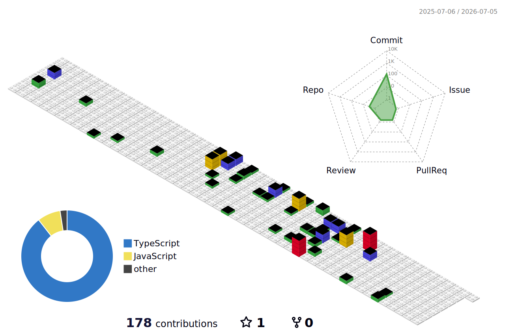

## 🤖 Benjamin Simon | Creative Developer 

#### 
**`Crafting Immersive Digital Experiences at the Intersection of Luxury & Tech`**

  Founder of <b>BNJOStudio</b>. I specialize in merging high-end aesthetics with surgical performance. 
   
  From bespoke animations to zero-latency SaaS, I build interfaces that are impossible to ignore.

  🏆 <b>Awwwards Academy Certified</b> | 🚀 <b>Top 1% Worldwide on CodersRank</b> | ⚡ <b>Next.js & Framer Motion Specialist</b>

---

### 📊 Professional Stats

  

 

### 🧰 The Stack

  

---

### 📫 Connect With Me

  <a href="https://www.linkedin.com/in/benjamiinsimon/"><b>LinkedIn</b></a> • 
  <a href="https://www.benjamin-simon.dev"><b>Portfolio</b></a> • 
  <a href="mailto:benjamin51.simon@gmail.com"><b>Email</b></a>

<picture align="center">
  <source media="(prefers-color-scheme: dark)" srcset="https://raw.githubusercontent.com/benjii66/benjii66/output/github-contribution-grid-snake-dark.svg">
  
</picture>

  
<b>🧩 My Commits & Activity</b>

   
  

<!-- leet code  -->
<!--  -->

<!-- ## Mes Projets

### Projet 1

- Description brève du projet 1

### Projet 2

- Description brève du projet 2

### Projet 3

- Description brève du projet 3
 -->
