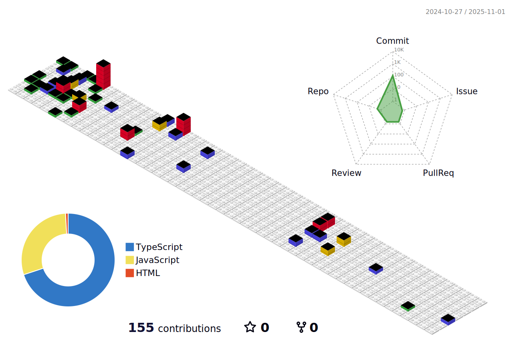

### 🤖 Benjamin Simon 

## **`From Web Integration to React Development, My Journey :`**

 
👋 Hey there! I'm a web integrator with a keen interest in frontend development. With an incoming diploma in web integration, I'm delving into the real of frontend technologies, aiming to craft captivating user interfaces and seamless experiences. I'm particularly passionate about React, and I'm excited to incorporate it into my projects as I continue to grow as a frontend developer ! Join me on this journey as I merge my skills in web integration with the power of React !🚀

---

### 🧰 Languages and Tools

 

 

#

<picture>
  <source media="(prefers-color-scheme: dark)" srcset="https://raw.githubusercontent.com/benjii66/benjii66/output/github-contribution-grid-snake-dark.svg">
  
</picture>

  
<b>📈&nbsp;&nbsp;Language&nbsp;/&nbsp;Framework stats</b>

   
  

<!--  -->

<!--
**benjii66/benjii66** is a ✨ _special_ ✨ repository because its `README.md` (this file) appears on your GitHub profile.

Here are some ideas to get you started:

- 🔭 I’m currently working on ...
- 🌱 I’m currently learning ...
- 👯 I’m looking to collaborate on ...
- 🤔 I’m looking for help with ...
- 💬 Ask me about ...
- 📫 How to reach me: ...
- 😄 Pronouns: ...
- ⚡ Fun fact: ...
-->

<!-- ## Mes Projets

### Projet 1

- Description brève du projet 1

### Projet 2

- Description brève du projet 2

### Projet 3

- Description brève du projet 3
 -->
